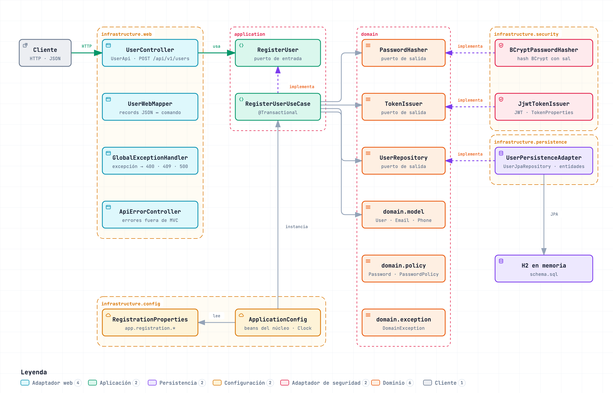
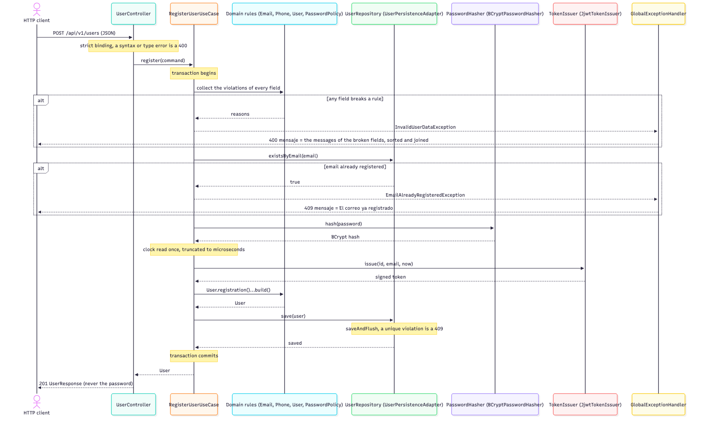
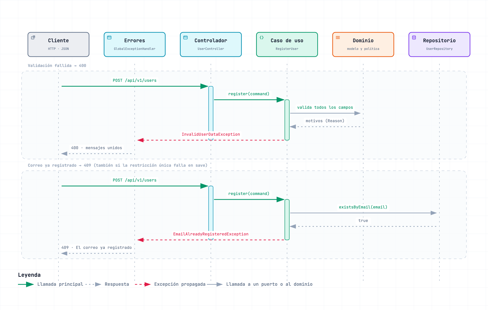

# API de registro de usuarios

Servicio REST con un solo endpoint, `POST /api/v1/users`, que registra un usuario y responde con el
usuario almacenado, un JWT firmado y los campos generados. Spring Boot 4.1.1, Java 17, base de datos H2
en memoria, solo JSON.

## Ejecutar

**Requisito:** cualquier JDK 17 o superior para iniciar Gradle (Gradle descarga un toolchain de JDK 17
si no hay ninguno instalado), o Docker.

```
./gradlew bootRun
```

El servicio escucha en `http://localhost:8080`. En otra terminal, registre el usuario de ejemplo del
enunciado:

```
curl -i -X POST http://localhost:8080/api/v1/users \
  -H 'Content-Type: application/json' \
  -d '{"name":"Juan Rodriguez","email":"juan@rodriguez.org","password":"hunter2","phones":[{"number":"1234567","citycode":"1","contrycode":"57"}]}'
```

La documentación interactiva (Swagger UI) está en `http://localhost:8080/swagger-ui.html`.

Cada caso de prueba (éxito, duplicado y cada tipo de rechazo) está como comando `curl` listo para copiar en [Casos de prueba con curl](#casos-de-prueba-con-curl).

**Alternativa solo con Docker:**

```
docker build -t registro-usuarios-api .
docker run --rm -p 8080:8080 registro-usuarios-api
```

La imagen tiene dos etapas (JDK 17 para construir, JRE 17 para ejecutar), corre como usuario sin
privilegios y expone el puerto 8080. No necesita configuración.

## Cumplimiento del enunciado

Dónde se cumple cada requisito del enunciado, en su orden:

| Requisito | Dónde se cumple |
|-----------|-----------------|
| Banco de datos en memoria | H2 en memoria: [`application.properties`](src/main/resources/application.properties) (`spring.datasource.url=jdbc:h2:mem:userdb...`) y la consola H2 de [Documentación de la API y base de datos](#documentación-de-la-api-y-base-de-datos) |
| Proceso de build vía Gradle o Maven | Gradle con wrapper: `./gradlew build` ([`build.gradle`](build.gradle)); ver [Pruebas y compuertas de calidad](#pruebas-y-compuertas-de-calidad) |
| Persistencia con JPA | Hibernate mediante Spring Data JPA: [`UserJpaEntity`](src/main/java/com/registro/usuarios/infrastructure/persistence/UserJpaEntity.java) y [`UserPersistenceAdapter`](src/main/java/com/registro/usuarios/infrastructure/persistence/UserPersistenceAdapter.java) |
| Framework Spring Boot | Spring Boot 4.1.1 ([`build.gradle`](build.gradle)) |
| Java 8+ | Java 17 (toolchain de [`build.gradle`](build.gradle)); el motivo está en [Supuestos sobre el enunciado](#supuestos-sobre-el-enunciado) |
| Repositorio público con código fuente y script de creación de BD | [`src/main/resources/schema.sql`](src/main/resources/schema.sql) |
| Readme explicando cómo probarlo | La sección [Ejecutar](#ejecutar), los [casos de prueba con curl](#casos-de-prueba-con-curl), [`scripts/acceptance.sh`](scripts/acceptance.sh) y la [colección de Postman](postman/registro-usuarios-api.postman_collection.json) |
| Diagrama de la solución | [Diagramas](#arquitectura) en `docs/diagrams` (PNG, fuente JSON y versión HTML interactiva) |
| JWT como token | [`JjwtTokenIssuer`](src/main/java/com/registro/usuarios/infrastructure/security/JjwtTokenIssuer.java): HS256 con `sub`, `email`, `iat` y `exp` |
| Pruebas unitarias | `./gradlew test` y el árbol [`src/test/java`](src/test/java) |
| Swagger | `http://localhost:8080/swagger-ui.html` |
| Patrones de diseño y buenas prácticas | [Patrones de diseño aplicados](#patrones-de-diseño-aplicados) y las [decisiones de arquitectura](docs/architecture-decisions.md) |

Y las reglas funcionales del registro:

| Regla del enunciado | Dónde se cumple |
|---------------------|-----------------|
| Solo JSON; los errores son `{"mensaje": "..."}` | [`UserApi`](src/main/java/com/registro/usuarios/infrastructure/web/UserApi.java) (`consumes` y `produces` JSON) y [Formato de error](#formato-de-error) |
| Respuesta con `id` (UUID), `created`, `modified`, `last_login`, `token` e `isactive` | [`UserResponse`](src/main/java/com/registro/usuarios/infrastructure/web/UserResponse.java) y [Qué responde](#qué-responde) |
| Un correo repetido responde `El correo ya registrado` | Estado `409`, en [Códigos de estado](#códigos-de-estado); la unicidad la garantiza la restricción `UNIQUE` de `users.email` |
| El correo se valida con una expresión regular | [`Email`](src/main/java/com/registro/usuarios/domain/model/Email.java), con el patrón de `app.registration.email-pattern` |
| La contraseña se valida con una expresión regular configurable | `app.registration.password-pattern`, en [Configuración](#configuración); [`RegexPasswordPolicy`](src/main/java/com/registro/usuarios/domain/policy/RegexPasswordPolicy.java) |
| El token se persiste con el usuario | Columna `users.token` de [`schema.sql`](src/main/resources/schema.sql); el motivo está en el [ADR-016](docs/architecture-decisions.md#adr-016-el-token-se-persiste-en-claro-y-la-clave-de-firma-es-efímera-salvo-que-se-configure) |

## Qué responde

La respuesta al ejemplo es `201` con este cuerpo (el id, las marcas de tiempo y el token cambian en
cada llamada; aquí el token está abreviado):

```json
{"id":"9048ce8d-03f7-4b80-a63c-e14f767b6cbb","name":"Juan Rodriguez","email":"juan@rodriguez.org","phones":[{"number":"1234567","citycode":"1","contrycode":"57"}],"created":"2026-10-08T00:25:56.057817Z","modified":"2026-10-08T00:25:56.057817Z","last_login":"2026-10-08T00:25:56.057817Z","token":"eyJhbGciOiJIUzI1NiJ9...","isactive":true}
```

`created`, `modified` y `last_login` son el mismo instante. El token es HS256 con los claims `sub` (el
id del usuario), `email`, `iat` y `exp` (15 minutos después de `iat` por defecto). La contraseña nunca
se devuelve. La respuesta `201` lleva el encabezado `Cache-Control: no-store`, porque contiene un token
al portador y ninguna caché debe guardarla.

Si se envía la misma solicitud otra vez, la respuesta es `409`:

```
{"mensaje":"El correo ya registrado"}
```

Una solicitud que rompe varias reglas informa todos los campos erróneos, ordenados y unidos con `"; "`
(el comando está en el [caso 16](#varios-campos-a-la-vez)):

```
{"mensaje":"El correo no tiene un formato válido; El nombre es obligatorio; La contraseña no cumple el formato requerido"}
```

### Códigos de estado

| Estado | Cuándo | `mensaje` |
|--------|--------|-----------|
| 201 | El usuario fue registrado | (el usuario, no un error) |
| 400 | Uno o más campos incumplen una regla | Los mensajes de los campos erróneos, unidos con `"; "` |
| 400 | El cuerpo no es JSON válido, está vacío o un campo tiene el tipo equivocado | `El cuerpo de la solicitud no es válido` |
| 400 | Cualquier otro 400 producido dentro de la aplicación | `La solicitud no es válida` |
| 404 | Ruta desconocida | `Recurso no encontrado` |
| 405 | Método incorrecto en una ruta conocida (se conserva el encabezado `Allow`) | `Método no permitido` |
| 406 | No se puede satisfacer el encabezado `Accept` | `Formato de respuesta no aceptable` |
| 409 | El correo ya está registrado | `El correo ya registrado` |
| 409 | Cualquier otro 409 sin rechazo tipado (por ejemplo un `sendError(409)` desde un filtro, o una excepción estándar de Spring MVC con ese estado); el registro no lo produce | `La solicitud entra en conflicto con el estado actual del recurso` |
| 415 | El `Content-Type` no es JSON | `Tipo de contenido no soportado` |
| 500 | Cualquier cosa inesperada | `Error interno del servidor` |

### Formato de error

Todo error es un objeto JSON con una sola clave, como exige el enunciado:

```json
{"mensaje": "..."}
```

El texto está en español. El valor rechazado nunca se repite en la respuesta, y un 500 nunca incluye
texto interno. El formato no es RFC 9457 porque el enunciado fija esta forma; el razonamiento está en
el [ADR-008](docs/architecture-decisions.md#adr-008-el-contrato-de-error-mensaje-en-lugar-de-rfc-9457).

## Casos de prueba con curl

Con el servicio en ejecución en `http://localhost:8080` (ver [Ejecutar](#ejecutar)), cada comando imprime el cuerpo de la respuesta y, en la línea siguiente, el estado HTTP. Los comandos funcionan igual en bash, zsh y fish.

Las respuestas de abajo son la salida real de cada comando, ejecutados en este orden sobre una instancia recién arrancada. **El orden importa en los casos 2 y 3**, que necesitan el caso 1 hecho antes (un `409` exige que el correo ya esté registrado); los demás casos usan correos propios y son independientes. La base de datos está en memoria: reiniciar el servicio la vacía y deja el caso 1 otra vez en `201`. En los `201` el `id`, las marcas de tiempo y el token cambian en cada llamada, por eso se abrevian con `...`; los cuerpos de error son literales.

### Registro correcto

**1. Ejemplo literal del enunciado**

```bash
curl -s -w '\n%{http_code}\n' -X POST http://localhost:8080/api/v1/users -H 'Content-Type: application/json' -d '{"name":"Juan Rodriguez","email":"juan@rodriguez.org","password":"hunter2","phones":[{"number":"1234567","citycode":"1","contrycode":"57"}]}'
```

Esperado: `201`

```json
{"id":"...","name":"Juan Rodriguez","email":"juan@rodriguez.org","phones":[{"number":"1234567","citycode":"1","contrycode":"57"}],"created":"...","modified":"...","last_login":"...","token":"...","isactive":true}
```

**2. El mismo registro otra vez (depende del caso 1)**

```bash
curl -s -w '\n%{http_code}\n' -X POST http://localhost:8080/api/v1/users -H 'Content-Type: application/json' -d '{"name":"Juan Rodriguez","email":"juan@rodriguez.org","password":"hunter2","phones":[{"number":"1234567","citycode":"1","contrycode":"57"}]}'
```

Esperado: `409` y `{"mensaje":"El correo ya registrado"}`

**3. El mismo correo en mayúsculas (depende del caso 1)**

```bash
curl -s -w '\n%{http_code}\n' -X POST http://localhost:8080/api/v1/users -H 'Content-Type: application/json' -d '{"name":"Juan Rodriguez","email":"JUAN@RODRIGUEZ.ORG","password":"hunter2","phones":[{"number":"1234567","citycode":"1","contrycode":"57"}]}'
```

Esperado: `409` y `{"mensaje":"El correo ya registrado"}`

**4. Correo con parte local de una sola letra repetida**

```bash
curl -s -w '\n%{http_code}\n' -X POST http://localhost:8080/api/v1/users -H 'Content-Type: application/json' -d '{"name":"Juan Rodriguez","email":"aaaaaaa@dominio.cl","password":"hunter2","phones":[{"number":"1234567","citycode":"1","contrycode":"57"}]}'
```

Esperado: `201`; el cuerpo tiene los mismos campos que el caso 1, con `"email":"aaaaaaa@dominio.cl"`.

**5. Sin la clave phones**

```bash
curl -s -w '\n%{http_code}\n' -X POST http://localhost:8080/api/v1/users -H 'Content-Type: application/json' -d '{"name":"Juan Rodriguez","email":"sin-telefonos@dominio.cl","password":"hunter2"}'
```

Esperado: `201`; el cuerpo tiene los mismos campos que el caso 1, con `"email":"sin-telefonos@dominio.cl"` y `"phones":[]`.

### Correo

**6. Correo sin @**

```bash
curl -s -w '\n%{http_code}\n' -X POST http://localhost:8080/api/v1/users -H 'Content-Type: application/json' -d '{"name":"Juan Rodriguez","email":"juan.rodriguez.org","password":"hunter2","phones":[{"number":"1234567","citycode":"1","contrycode":"57"}]}'
```

Esperado: `400` y `{"mensaje":"El correo no tiene un formato válido"}`

**7. Correo sin punto en el dominio**

```bash
curl -s -w '\n%{http_code}\n' -X POST http://localhost:8080/api/v1/users -H 'Content-Type: application/json' -d '{"name":"Juan Rodriguez","email":"juan@rodriguez","password":"hunter2","phones":[{"number":"1234567","citycode":"1","contrycode":"57"}]}'
```

Esperado: `400` y `{"mensaje":"El correo no tiene un formato válido"}`

**8. Correo con espacios**

```bash
curl -s -w '\n%{http_code}\n' -X POST http://localhost:8080/api/v1/users -H 'Content-Type: application/json' -d '{"name":"Juan Rodriguez","email":"juan perez@rodriguez.org","password":"hunter2","phones":[{"number":"1234567","citycode":"1","contrycode":"57"}]}'
```

Esperado: `400` y `{"mensaje":"El correo no tiene un formato válido"}`

**9. Correo vacío**

```bash
curl -s -w '\n%{http_code}\n' -X POST http://localhost:8080/api/v1/users -H 'Content-Type: application/json' -d '{"name":"Juan Rodriguez","email":"","password":"hunter2","phones":[{"number":"1234567","citycode":"1","contrycode":"57"}]}'
```

Esperado: `400` y `{"mensaje":"El correo es obligatorio"}`

**10. Correo con el tipo JSON equivocado (número)**

```bash
curl -s -w '\n%{http_code}\n' -X POST http://localhost:8080/api/v1/users -H 'Content-Type: application/json' -d '{"name":"Juan Rodriguez","email":123,"password":"hunter2"}'
```

Esperado: `400` y `{"mensaje":"El cuerpo de la solicitud no es válido"}`

### Contraseña

**11. Contraseña que no cumple el patrón por defecto**

```bash
curl -s -w '\n%{http_code}\n' -X POST http://localhost:8080/api/v1/users -H 'Content-Type: application/json' -d '{"name":"Juan Rodriguez","email":"clave1@dominio.cl","password":"abc","phones":[{"number":"1234567","citycode":"1","contrycode":"57"}]}'
```

Esperado: `400` y `{"mensaje":"La contraseña no cumple el formato requerido"}`

**12. Contraseña ausente**

```bash
curl -s -w '\n%{http_code}\n' -X POST http://localhost:8080/api/v1/users -H 'Content-Type: application/json' -d '{"name":"Juan Rodriguez","email":"clave2@dominio.cl","phones":[{"number":"1234567","citycode":"1","contrycode":"57"}]}'
```

Esperado: `400` y `{"mensaje":"La contraseña es obligatoria"}`

**13. Contraseña de más de 72 bytes**

```bash
curl -s -w '\n%{http_code}\n' -X POST http://localhost:8080/api/v1/users -H 'Content-Type: application/json' -d '{"name":"Juan Rodriguez","email":"clave3@dominio.cl","password":"a1aaaaaaaaaaaaaaaaaaaaaaaaaaaaaaaaaaaaaaaaaaaaaaaaaaaaaaaaaaaaaaaaaaaaaaa","phones":[{"number":"1234567","citycode":"1","contrycode":"57"}]}'
```

Esperado: `400` y `{"mensaje":"La contraseña es demasiado larga"}`

### Nombre

**14. Nombre vacío**

```bash
curl -s -w '\n%{http_code}\n' -X POST http://localhost:8080/api/v1/users -H 'Content-Type: application/json' -d '{"name":"","email":"nombre1@dominio.cl","password":"hunter2","phones":[{"number":"1234567","citycode":"1","contrycode":"57"}]}'
```

Esperado: `400` y `{"mensaje":"El nombre es obligatorio"}`

**15. Nombre ausente**

```bash
curl -s -w '\n%{http_code}\n' -X POST http://localhost:8080/api/v1/users -H 'Content-Type: application/json' -d '{"email":"nombre2@dominio.cl","password":"hunter2","phones":[{"number":"1234567","citycode":"1","contrycode":"57"}]}'
```

Esperado: `400` y `{"mensaje":"El nombre es obligatorio"}`

### Varios campos a la vez

**16. Varios campos inválidos en la misma solicitud**

```bash
curl -s -w '\n%{http_code}\n' -X POST http://localhost:8080/api/v1/users -H 'Content-Type: application/json' -d '{"name":"","email":"bad","password":"x"}'
```

Esperado: `400` y `{"mensaje":"El correo no tiene un formato válido; El nombre es obligatorio; La contraseña no cumple el formato requerido"}`

### Teléfonos

**17. Número de teléfono con letras**

```bash
curl -s -w '\n%{http_code}\n' -X POST http://localhost:8080/api/v1/users -H 'Content-Type: application/json' -d '{"name":"Juan Rodriguez","email":"tel1@dominio.cl","password":"hunter2","phones":[{"number":"12ab567","citycode":"1","contrycode":"57"}]}'
```

Esperado: `400` y `{"mensaje":"El número de teléfono solo puede contener dígitos"}`

**18. Teléfono al que le falta un campo**

```bash
curl -s -w '\n%{http_code}\n' -X POST http://localhost:8080/api/v1/users -H 'Content-Type: application/json' -d '{"name":"Juan Rodriguez","email":"tel2@dominio.cl","password":"hunter2","phones":[{"number":"1234567","citycode":"1"}]}'
```

Esperado: `400` y `{"mensaje":"El código de país es obligatorio"}`

**19. Más de 10 teléfonos**

```bash
curl -s -w '\n%{http_code}\n' -X POST http://localhost:8080/api/v1/users -H 'Content-Type: application/json' -d '{"name":"Juan Rodriguez","email":"tel3@dominio.cl","password":"hunter2","phones":[{"number":"1234567","citycode":"1","contrycode":"57"},{"number":"1234567","citycode":"1","contrycode":"57"},{"number":"1234567","citycode":"1","contrycode":"57"},{"number":"1234567","citycode":"1","contrycode":"57"},{"number":"1234567","citycode":"1","contrycode":"57"},{"number":"1234567","citycode":"1","contrycode":"57"},{"number":"1234567","citycode":"1","contrycode":"57"},{"number":"1234567","citycode":"1","contrycode":"57"},{"number":"1234567","citycode":"1","contrycode":"57"},{"number":"1234567","citycode":"1","contrycode":"57"},{"number":"1234567","citycode":"1","contrycode":"57"}]}'
```

Esperado: `400` y `{"mensaje":"No se permiten más de 10 teléfonos"}`

### Formato de la solicitud

**20. JSON mal formado**

El cuerpo tiene una coma sobrante antes de la llave de cierre. Las llaves quedan balanceadas a propósito,
para que el comando se pueda pegar en una terminal que completa pares de llaves y comillas.

```bash
curl -s -w '\n%{http_code}\n' -X POST http://localhost:8080/api/v1/users -H 'Content-Type: application/json' -d '{"name":"Juan",}'
```

Esperado: `400` y `{"mensaje":"El cuerpo de la solicitud no es válido"}`

**21. Content-Type text/plain**

```bash
curl -s -w '\n%{http_code}\n' -X POST http://localhost:8080/api/v1/users -H 'Content-Type: text/plain' -d '{"name":"Juan Rodriguez","email":"ct1@dominio.cl","password":"hunter2","phones":[{"number":"1234567","citycode":"1","contrycode":"57"}]}'
```

Esperado: `415` y `{"mensaje":"Tipo de contenido no soportado"}`

**22. Content-Type multipart/form-data**

```bash
curl -s -w '\n%{http_code}\n' -X POST http://localhost:8080/api/v1/users -H 'Content-Type: multipart/form-data' -d '{"name":"Juan Rodriguez","email":"ct2@dominio.cl","password":"hunter2","phones":[{"number":"1234567","citycode":"1","contrycode":"57"}]}'
```

Esperado: `415` y `{"mensaje":"Tipo de contenido no soportado"}`

**23. Accept application/xml**

```bash
curl -s -w '\n%{http_code}\n' -X POST http://localhost:8080/api/v1/users -H 'Content-Type: application/json' -H 'Accept: application/xml' -d '{"name":"Juan Rodriguez","email":"acc1@dominio.cl","password":"hunter2","phones":[{"number":"1234567","citycode":"1","contrycode":"57"}]}'
```

Esperado: `406` y `{"mensaje":"Formato de respuesta no aceptable"}`

### Rutas y métodos

**24. GET sobre la ruta de registro**

```bash
curl -s -w '\n%{http_code}\n' http://localhost:8080/api/v1/users
```

Esperado: `405` y `{"mensaje":"Método no permitido"}`

**25. Ruta desconocida**

```bash
curl -s -w '\n%{http_code}\n' http://localhost:8080/api/v1/nada
```

Esperado: `404` y `{"mensaje":"Recurso no encontrado"}`

**26. Barra final en la ruta de registro (limitación documentada)**

```bash
curl -s -w '\n%{http_code}\n' -X POST http://localhost:8080/api/v1/users/ -H 'Content-Type: application/json' -d '{"name":"Juan Rodriguez","email":"barra@dominio.cl","password":"hunter2","phones":[{"number":"1234567","citycode":"1","contrycode":"57"}]}'
```

Esperado: `404` y `{"mensaje":"Recurso no encontrado"}`

### Encabezados de la respuesta

**27. La respuesta 201 lleva Cache-Control: no-store**

```bash
curl -s -D - -o /dev/null -X POST http://localhost:8080/api/v1/users -H 'Content-Type: application/json' -d '{"name":"Juan Rodriguez","email":"cache@dominio.cl","password":"hunter2","phones":[{"number":"1234567","citycode":"1","contrycode":"57"}]}'
```

Esperado (entre otros encabezados):

```
HTTP/1.1 201 
Cache-Control: no-store
Content-Type: application/json
```

### Documentación

**28. Swagger UI (la interfaz)**

```bash
curl -s -o /dev/null -w '%{http_code}\n' http://localhost:8080/swagger-ui/index.html
```

Esperado: `200`

**29. Swagger UI (la dirección corta redirige)**

```bash
curl -s -o /dev/null -w '%{http_code}\n' http://localhost:8080/swagger-ui.html
```

Esperado: `302` (redirige a `/swagger-ui/index.html`)

**30. Documento OpenAPI**

```bash
curl -s -o /dev/null -w '%{http_code}\n' http://localhost:8080/v3/api-docs
```

Esperado: `200`

### Casos adicionales

**31. Correo en mayúsculas en un registro nuevo (se guarda en minúsculas)**

```bash
curl -s -w '\n%{http_code}\n' -X POST http://localhost:8080/api/v1/users -H 'Content-Type: application/json' -d '{"name":"Juan Rodriguez","email":"MAYUS@dominio.cl","password":"hunter2","phones":[{"number":"1234567","citycode":"1","contrycode":"57"}]}'
```

Esperado: `201`; el cuerpo tiene los mismos campos que el caso 1, con `"email":"mayus@dominio.cl"`.

**32. Contraseña sin dígitos**

```bash
curl -s -w '\n%{http_code}\n' -X POST http://localhost:8080/api/v1/users -H 'Content-Type: application/json' -d '{"name":"Juan Rodriguez","email":"clave4@dominio.cl","password":"abcdefgh","phones":[{"number":"1234567","citycode":"1","contrycode":"57"}]}'
```

Esperado: `400` y `{"mensaje":"La contraseña no cumple el formato requerido"}`

**33. Contraseña con espacios**

```bash
curl -s -w '\n%{http_code}\n' -X POST http://localhost:8080/api/v1/users -H 'Content-Type: application/json' -d '{"name":"Juan Rodriguez","email":"clave5@dominio.cl","password":"hunter 2x","phones":[{"number":"1234567","citycode":"1","contrycode":"57"}]}'
```

Esperado: `400` y `{"mensaje":"La contraseña no cumple el formato requerido"}`

**34. Contraseña de menos de 7 caracteres**

```bash
curl -s -w '\n%{http_code}\n' -X POST http://localhost:8080/api/v1/users -H 'Content-Type: application/json' -d '{"name":"Juan Rodriguez","email":"clave6@dominio.cl","password":"a1b2c3","phones":[{"number":"1234567","citycode":"1","contrycode":"57"}]}'
```

Esperado: `400` y `{"mensaje":"La contraseña no cumple el formato requerido"}`

**35. Nombre de más de 255 caracteres**

```bash
curl -s -w '\n%{http_code}\n' -X POST http://localhost:8080/api/v1/users -H 'Content-Type: application/json' -d '{"name":"nnnnnnnnnnnnnnnnnnnnnnnnnnnnnnnnnnnnnnnnnnnnnnnnnnnnnnnnnnnnnnnnnnnnnnnnnnnnnnnnnnnnnnnnnnnnnnnnnnnnnnnnnnnnnnnnnnnnnnnnnnnnnnnnnnnnnnnnnnnnnnnnnnnnnnnnnnnnnnnnnnnnnnnnnnnnnnnnnnnnnnnnnnnnnnnnnnnnnnnnnnnnnnnnnnnnnnnnnnnnnnnnnnnnnnnnnnnnnnnnnnnnnnnnnnnnnnnn","email":"nombre3@dominio.cl","password":"hunter2","phones":[{"number":"1234567","citycode":"1","contrycode":"57"}]}'
```

Esperado: `400` y `{"mensaje":"El nombre no debe superar 255 caracteres"}`

**36. Correo de más de 254 caracteres**

```bash
curl -s -w '\n%{http_code}\n' -X POST http://localhost:8080/api/v1/users -H 'Content-Type: application/json' -d '{"name":"Juan Rodriguez","email":"aaaaaaaaaaaaaaaaaaaaaaaaaaaaaaaaaaaaaaaaaaaaaaaaaaaaaaaaaaaaaaaaaaaaaaaaaaaaaaaaaaaaaaaaaaaaaaaaaaaaaaaaaaaaaaaaaaaaaaaaaaaaaaaaaaaaaaaaaaaaaaaaaaaaaaaaaaaaaaaaaaaaaaaaaaaaaaaaaaaaaaaaaaaaaaaaaaaaaaaaaaaaaaaaaaaaaaaaaaaaaaaaaaaaaaaaaaaaaaaaaaaaaaaaaa@d.cl","password":"hunter2","phones":[{"number":"1234567","citycode":"1","contrycode":"57"}]}'
```

Esperado: `400` y `{"mensaje":"El correo no debe superar 254 caracteres"}`

**37. Número de teléfono de más de 20 caracteres**

```bash
curl -s -w '\n%{http_code}\n' -X POST http://localhost:8080/api/v1/users -H 'Content-Type: application/json' -d '{"name":"Juan Rodriguez","email":"tel4@dominio.cl","password":"hunter2","phones":[{"number":"111111111111111111111","citycode":"1","contrycode":"57"}]}'
```

Esperado: `400` y `{"mensaje":"El número de teléfono no debe superar 20 caracteres"}`

**38. Lista de teléfonos vacía**

```bash
curl -s -w '\n%{http_code}\n' -X POST http://localhost:8080/api/v1/users -H 'Content-Type: application/json' -d '{"name":"Juan Rodriguez","email":"tel5@dominio.cl","password":"hunter2","phones":[]}'
```

Esperado: `201`; el cuerpo tiene los mismos campos que el caso 1, con `"email":"tel5@dominio.cl"` y `"phones":[]`.

**39. Teléfonos con el tipo JSON equivocado (texto)**

```bash
curl -s -w '\n%{http_code}\n' -X POST http://localhost:8080/api/v1/users -H 'Content-Type: application/json' -d '{"name":"Juan Rodriguez","email":"tel6@dominio.cl","password":"hunter2","phones":"1234567"}'
```

Esperado: `400` y `{"mensaje":"El cuerpo de la solicitud no es válido"}`

**40. Cuerpo vacío**

```bash
curl -s -w '\n%{http_code}\n' -X POST http://localhost:8080/api/v1/users -H 'Content-Type: application/json'
```

Esperado: `400` y `{"mensaje":"El cuerpo de la solicitud no es válido"}`

**41. Cuerpo JSON que no es un objeto**

```bash
curl -s -w '\n%{http_code}\n' -X POST http://localhost:8080/api/v1/users -H 'Content-Type: application/json' -d '[]'
```

Esperado: `400` y `{"mensaje":"El cuerpo de la solicitud no es válido"}`

## Configuración

Las propiedades están en [`src/main/resources/application.properties`](src/main/resources/application.properties).
Cualquiera se puede fijar desde el entorno.

| Propiedad | Variable de entorno | Valor por defecto | Significado |
|-----------|---------------------|-------------------|-------------|
| `app.registration.email-pattern` | `APP_REGISTRATION_EMAIL_PATTERN` | `^[a-z0-9._%+-]+@[a-z0-9-]+(\.[a-z0-9-]+)*\.[a-z]{2,}$` | Formato del correo, aplicado a la dirección en minúsculas |
| `app.registration.password-pattern` | `APP_REGISTRATION_PASSWORD_PATTERN` | `^(?=.*[A-Za-z])(?=.*[0-9])\S{7,72}$` | Formato de la contraseña: una letra y un dígito, de 7 a 72 caracteres sin espacios |
| `app.token.secret` | `TOKEN_SECRET` | ninguno | Secreto de firma HS256, de al menos 32 bytes; la aplicación no arranca con uno más corto. Si no se define, se genera una clave aleatoria de 256 bits al arrancar y los tokens no sobreviven a un reinicio |
| `app.token.expiration` | `APP_TOKEN_EXPIRATION` | `15m` | Vigencia del token (`120s`, `15m`, ...); rango permitido: mayor que cero y hasta 24 horas (`24h`); fuera de ese rango la aplicación no arranca |

**La aplicación no distribuye ningún secreto de firma.** Sin `TOKEN_SECRET` el servicio genera una
clave aleatoria en cada arranque y registra una línea `INFO` que lo indica (nunca la clave). Fíjelo
para que los tokens sigan siendo válidos tras un reinicio:

```
docker run --rm -p 8080:8080 -e TOKEN_SECRET='replace-with-at-least-32-random-bytes' registro-usuarios-api
```

**El patrón de contraseña por defecto es débil a propósito**, porque la contraseña de ejemplo del
enunciado, `hunter2`, debe pasar. Para exigir doce o más caracteres con una minúscula, una mayúscula,
un dígito y un símbolo:

```
APP_REGISTRATION_PASSWORD_PATTERN='^(?=.*[a-z])(?=.*[A-Z])(?=.*[0-9])(?=.*[^A-Za-z0-9\s])\S{12,72}$' ./gradlew bootRun
```

Con ese patrón, `hunter2` recibe `400` y `La contraseña no cumple el formato requerido`. El límite de
72 bytes de la contraseña se mantiene sea cual sea el patrón.

La consola H2 y Swagger UI son herramientas de desarrollo y vienen activadas. Para desactivarlas:

```
SPRING_H2_CONSOLE_ENABLED=false SPRINGDOC_SWAGGER_UI_ENABLED=false ./gradlew bootRun
```

## Documentación de la API y base de datos

| Qué | Valor |
|-----|-------|
| Swagger UI | `http://localhost:8080/swagger-ui.html` |
| Documento OpenAPI | `http://localhost:8080/v3/api-docs` |
| Script de creación | [`src/main/resources/schema.sql`](src/main/resources/schema.sql) |
| Consola H2 | `http://localhost:8080/h2-console` |
| URL JDBC | `jdbc:h2:mem:userdb` |
| Usuario / contraseña | `sa` / (vacía) |

La base de datos es H2 en memoria: se crea al arrancar y se pierde cuando el proceso se detiene. El
script crea `users` (con restricción `UNIQUE` sobre el correo) y `phones` (una fila por teléfono,
enlazada al usuario por una clave foránea). Hibernate solo lo valida (`ddl-auto=validate`); nunca crea
ni altera una tabla.

**La consola H2 solo acepta conexiones locales**: se usa con `./gradlew bootRun`. Con `docker run -p`
la página se sirve, pero rechaza la conexión ("remote connections are disabled").

## Pruebas y compuertas de calidad

```
./gradlew test                       # la suite de pruebas
./gradlew build                      # compila, verifica formato, pruebas y umbral de cobertura
./gradlew clean build --rerun-tasks  # lo mismo desde cero, sin caché
./gradlew spotlessApply              # corrige el formato
bash scripts/acceptance.sh           # con el servicio en marcha: solicitudes reales con curl
npx -y newman run postman/registro-usuarios-api.postman_collection.json   # colección de Postman
```

- **Capas de prueba:** JUnit simple para el dominio y el caso de uso (sin Spring ni base de datos),
  cortes de Spring para los adaptadores web y de persistencia, pruebas de contexto completo sobre HTTP
  real contra H2, y pruebas de arquitectura.
- **Cobertura:** JaCoCo exige al menos 80 % de líneas en `domain` y `application`. La infraestructura
  se mide, pero no tiene umbral. El informe queda en `build/reports/jacoco/test/html/index.html`.
- **Verificaciones estáticas:** Spotless con Google Java Format, Error Prone, `-Xlint:all -Werror` y
  reglas de ArchUnit (el dominio no importa ningún framework, las dependencias apuntan hacia adentro,
  los adaptadores no dependen entre sí, sin ciclos entre paquetes, sin inyección en campos). Una segunda clase de pruebas demuestra
  que cada regla falla cuando una clase de fixture la rompe.
- **Script de aceptación:** hace solicitudes reales con `curl` (el ejemplo del enunciado, el duplicado,
  cuerpos inválidos y mal formados, 404, 405, 406, 415, Swagger UI y el documento OpenAPI) y termina con
  código distinto de cero en el primer fallo. Se puede ejecutar varias veces sobre la misma instancia,
  porque cada ejecución registra una dirección distinta; `BASE_URL` apunta a otra dirección.
- **Colección de Postman:** ver la sección siguiente.
- **CI:** [`.github/workflows/ci.yml`](.github/workflows/ci.yml) ejecuta `./gradlew build` y construye la
  imagen en cada push y pull request a `main`.

## Colección de Postman

[`postman/registro-usuarios-api.postman_collection.json`](postman/registro-usuarios-api.postman_collection.json)
(Postman Collection v2.1) tiene 17 solicitudes con sus pruebas: el registro, el duplicado, cada tipo de
rechazo, 404, 405, 406, 415, el documento OpenAPI y una prueba manual. La solicitud `00` envía el ejemplo literal del
enunciado: responde `201` la primera vez y `409` después, y su prueba acepta ambos. Las demás usan un
correo distinto en cada ejecución, de modo que la colección se puede repetir sobre la misma instancia.

La solicitud `16` es una prueba manual para probar valores propios: toma `nombre`, `correo`, `clave`,
`telefono`, `codigoCiudad` y `codigoPais` de las variables de la colección (pestaña *Variables*) o se edita
directamente en la pestaña *Body*. Acepta `201`, `400` y `409`, y escribe un resumen en la consola de Postman.

- **Importar en Postman:** *Import*, elegir el archivo. La variable de colección `baseUrl` vale
  `http://localhost:8080`; cámbiela si el servicio escucha en otra dirección.
- **Ejecutar con Newman** (con el servicio en marcha):

```
npx -y newman run postman/registro-usuarios-api.postman_collection.json
npx -y newman run postman/registro-usuarios-api.postman_collection.json --env-var baseUrl=http://localhost:9090
```

## Arquitectura



Las líneas continuas son "usa" y las discontinuas "implementa". Toda dependencia que cruza la frontera
del núcleo (`application` y `domain`) apunta hacia adentro. Las dos flechas que quedan fuera del núcleo
son `lee` (de `ApplicationConfig` a `RegistrationProperties`) y `JPA` (de `UserPersistenceAdapter` a H2).
Del uso que el adaptador web hace del dominio se dibuja una flecha, la de `GlobalExceptionHandler` a
`domain.exception`; no se dibuja que `UserController`, `UserWebMapper`, `ErrorMessages` y los records
web también leen tipos de `domain.model`, ni que los puertos y sus adaptadores reciben `User`, `Email` y
`UserId`.





Cada diagrama tiene, en [`docs/diagrams`](docs/diagrams), su fuente en JSON, el PNG de arriba y una versión
HTML interactiva y autocontenida (tema claro y oscuro, búsqueda y zoom) que se abre en el navegador tras
clonar el repositorio. En la versión interactiva, un clic en un componente abre una ficha con qué es, su
paquete y sus relaciones de entrada y de salida, y debajo del diagrama hay tarjetas que explican cada
componente, cada flecha y cada paso, con la clase, el método y el archivo. El de arquitectura añade un
recorrido guiado de cinco capítulos que sigue un registro de extremo a extremo; los de secuencia numeran
los mensajes y los dibujan en orden al abrir la página. Los controles del visor están en inglés.

| Diagrama | Fuente | Interactivo |
|---|---|---|
| Arquitectura | [`components.json`](docs/diagrams/components.json) | [`components.html`](docs/diagrams/components.html) |
| Registro, camino feliz | [`registration-sequence.json`](docs/diagrams/registration-sequence.json) | [`registration-sequence.html`](docs/diagrams/registration-sequence.html) |
| Registro, errores | [`registration-sequence-errors.json`](docs/diagrams/registration-sequence-errors.json) | [`registration-sequence-errors.html`](docs/diagrams/registration-sequence-errors.html) |

El HTML y el PNG se regeneran desde el JSON con [`docs/diagrams/build.sh`](docs/diagrams/build.sh), que
requiere Node.js 18 o superior, Python 3, Chrome o Chromium y una copia de
[Archify](https://github.com/tt-a1i/archify) 2.17:

```bash
ARCHIFY_HOME=/ruta/a/archify docs/diagrams/build.sh
```

- `domain` no tiene framework: `User`, `Email`, `Phone`, `UserId`, las reglas de validación (con sus
  motivos tipados, `Reason`), los límites fijos de la contraseña (`Password`), el formato configurable
  (`PasswordPolicy`) y los tres puertos de salida (`UserRepository`, `PasswordHasher`, `TokenIssuer`).
- `application` tiene el puerto de entrada `RegisterUser` (con su comando) y una sola implementación,
  `RegisterUserUseCase`, que orquesta el registro y es dueña de la transacción. `@Transactional` es el
  único tipo del framework permitido allí.
- `infrastructure` contiene los adaptadores: `web` (controlador, records JSON, manejo de errores),
  `persistence` (JPA), `security` (BCrypt, JJWT) y `config` (cableado y propiedades).

**Por qué un hexágono para un solo endpoint.** Hay puertos donde hay una dependencia reemplazable: la
base de datos, el hash de contraseñas y la firma de tokens. Eso permite probar el dominio y el caso de
uso sin contenedor ni base de datos, y mantiene los tipos de terceros (JPA, BCrypt, JJWT) fuera de las
reglas de negocio. El costo, dicho en una frase: hay más tipos de los que el comportamiento necesita, y
un servicio tan pequeño normalmente no requeriría un hexágono. Cada decisión, con las alternativas
descartadas, está en [`docs/architecture-decisions.md`](docs/architecture-decisions.md#adr-001-un-hexágono-ligero-para-un-servicio-de-un-solo-endpoint).

### Patrones de diseño aplicados

| Patrón | Dónde | Qué problema resuelve aquí |
|--------|-------|----------------------------|
| Puertos y adaptadores (arquitectura hexagonal) | Puerto de entrada [`RegisterUser`](src/main/java/com/registro/usuarios/application/port/RegisterUser.java); puertos de salida [`UserRepository`](src/main/java/com/registro/usuarios/domain/port/UserRepository.java), [`PasswordHasher`](src/main/java/com/registro/usuarios/domain/port/PasswordHasher.java) y [`TokenIssuer`](src/main/java/com/registro/usuarios/domain/port/TokenIssuer.java), implementados en `infrastructure` | El dominio y el caso de uso se prueban sin base de datos, BCrypt ni JJWT |
| Repository | [`UserRepository`](src/main/java/com/registro/usuarios/domain/port/UserRepository.java) y [`UserPersistenceAdapter`](src/main/java/com/registro/usuarios/infrastructure/persistence/UserPersistenceAdapter.java) | El dominio guarda un usuario sin conocer JPA |
| Adapter | [`UserPersistenceAdapter`](src/main/java/com/registro/usuarios/infrastructure/persistence/UserPersistenceAdapter.java), [`BCryptPasswordHasher`](src/main/java/com/registro/usuarios/infrastructure/security/BCryptPasswordHasher.java), [`JjwtTokenIssuer`](src/main/java/com/registro/usuarios/infrastructure/security/JjwtTokenIssuer.java) | Adapta las interfaces de JPA, BCrypt y JJWT a los puertos del dominio |
| Strategy | [`PasswordPolicy`](src/main/java/com/registro/usuarios/domain/policy/PasswordPolicy.java) y [`RegexPasswordPolicy`](src/main/java/com/registro/usuarios/domain/policy/RegexPasswordPolicy.java) | Separa el formato de la contraseña, que el enunciado pide configurable, de los límites fijos de `Password`. Tiene una sola implementación de producción: existe por esa regla configurable, no por variedad |
| Value Object | [`Email`](src/main/java/com/registro/usuarios/domain/model/Email.java), [`UserId`](src/main/java/com/registro/usuarios/domain/model/UserId.java), [`Phone`](src/main/java/com/registro/usuarios/domain/model/Phone.java) | Normalización y validez en un solo lugar; un valor inválido no llega a existir |
| Builder | `User.Builder` en [`User`](src/main/java/com/registro/usuarios/domain/model/User.java) | Evita pasar por error un token donde va un hash: tres `String` contiguos |
| Método de fábrica estático | `User.registration()`, `Email.of` y `UserId.generate()` | Construyen con validación o con el valor generado por la aplicación, sin exponer el constructor. No es el patrón Factory de GoF, que no se usa |
| DTO y Mapper | Records [`RegisterUserRequest`](src/main/java/com/registro/usuarios/infrastructure/web/RegisterUserRequest.java) y [`UserResponse`](src/main/java/com/registro/usuarios/infrastructure/web/UserResponse.java); [`UserWebMapper`](src/main/java/com/registro/usuarios/infrastructure/web/UserWebMapper.java) | El JSON no se acopla al dominio, y la respuesta nunca lee el hash de la contraseña |
| Inyección de dependencias por constructor | [`ApplicationConfig`](src/main/java/com/registro/usuarios/infrastructure/config/ApplicationConfig.java) cablea el caso de uso con sus puertos | Las dependencias son explícitas y se sustituyen en pruebas; una regla de ArchUnit prohíbe la inyección en campos |

El razonamiento de cada uno está en [`docs/architecture-decisions.md`](docs/architecture-decisions.md#adr-001-un-hexágono-ligero-para-un-servicio-de-un-solo-endpoint). Se descartaron a propósito Factory, Observer, los eventos de dominio y CQRS, y no se usan bibliotecas de mapeo ni Lombok ([ADR-001](docs/architecture-decisions.md#adr-001-un-hexágono-ligero-para-un-servicio-de-un-solo-endpoint) y [ADR-022](docs/architecture-decisions.md#adr-022-lo-que-se-dejó-fuera-deliberadamente)).

## Supuestos sobre el enunciado

- **`contrycode` se conserva tal como está escrito.** El enunciado escribe así el campo de país del
  teléfono, de modo que solicitudes, respuestas y el documento OpenAPI lo usan
  ([ADR-018](docs/architecture-decisions.md#adr-018-el-contrycode-literal)).
- **`{"mensaje": "..."}` se usa solo para errores.** Las respuestas exitosas llevan el usuario, sin
  envoltorio.
- **Un correo duplicado es un 409.** El texto es el que da el enunciado.
- **Los teléfonos son opcionales.** `phones` puede estar ausente, ser `null` o vacío y siempre se
  devuelve como arreglo. Cada teléfono necesita sus tres campos.
- **Los campos de teléfono son dígitos.** `number` y `citycode` contienen solo los dígitos 0 a 9;
  `contrycode` son dígitos con un `+` inicial opcional. El ejemplo del enunciado (`"1234567"`, `"1"`,
  `"57"`) es válido; `"123-4567"` o `"57+"` reciben un `400` con su propio mensaje.
- **El correo se pasa a minúsculas y no se recorta.** Dos direcciones que difieren solo en mayúsculas
  son la misma dirección.
- **Los límites de los campos son supuestos**, porque el enunciado no da ninguno: nombre 255
  caracteres, correo 254, contraseña 72 bytes, 10 teléfonos, número de teléfono 20 caracteres, códigos
  de ciudad y de país 10 cada uno.
- **El token se almacena en claro**, porque el enunciado exige que se persista.
- **Java 17 en lugar de "Java 8+".** Spring Boot 3 y posteriores necesitan Java 17
  ([ADR-011](docs/architecture-decisions.md#adr-011-spring-boot-411-y-java-17-frente-al-java-8-del-enunciado)).

## Limitaciones conocidas

- Las solicitudes que el contenedor de servlets rechaza antes de que corra código de la aplicación (una
  secuencia de porcentaje inválida en la ruta, una línea de solicitud mal formada, encabezados
  demasiado grandes) se responden con la página de error propia del contenedor y quedan fuera del
  contrato JSON.
- Sin `TOKEN_SECRET` la clave de firma es efímera y los tokens no sobreviven a un reinicio; el token se
  almacena en claro.
- El patrón de contraseña por defecto es débil a propósito.
- Los datos están en memoria y se pierden al reiniciar.
- La consola H2 y Swagger UI vienen activadas.
- Una barra final (`POST /api/v1/users/`) responde `404`, y la aplicación no fija un tamaño máximo para
  el cuerpo de la solicitud más allá de los valores por defecto del servidor.
- Una respuesta de duplicado le dice a quien llama que una dirección está registrada.

La lista completa, con su razonamiento, está al final de
[`docs/architecture-decisions.md`](docs/architecture-decisions.md#limitaciones-conocidas).
