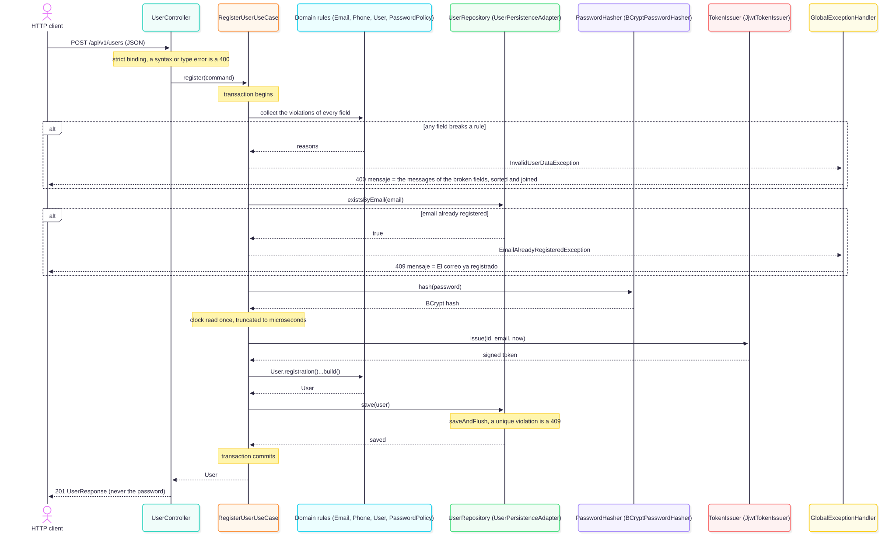

**Requires any JDK 17 or newer to launch Gradle (Gradle downloads a JDK 17 toolchain if none is installed), or Docker.**

# User registration API

A REST service with one endpoint, `POST /api/v1/users`, that registers a user and answers with the
stored user, a signed JWT and the generated fields. Spring Boot 4.1.1, Java 17, an in-memory H2
database, JSON only.

## Quick start

Run it with Gradle (the build compiles and tests on a Java 17 toolchain; if no JDK 17 is installed,
Gradle downloads one the first time):

```
./gradlew bootRun
```

The service listens on `http://localhost:8080`. Alternatively, with Docker only:

```
docker build -t registro-usuarios-api .
docker run --rm -p 8080:8080 registro-usuarios-api
```

The image has two stages (JDK 17 to build, JRE 17 to run), runs as a non-root user and exposes
port 8080.

## Try it

Register the example user from the exercise statement:

```
curl -i -X POST http://localhost:8080/api/v1/users \
  -H 'Content-Type: application/json' \
  -d '{"name":"Juan Rodriguez","email":"juan@rodriguez.org","password":"hunter2","phones":[{"number":"1234567","citycode":"1","contrycode":"57"}]}'
```

The answer is `201` with this body (the id, the timestamps and the token differ on every call; the
token is shortened here):

```json
{"id":"eac35bbc-1f3b-430a-8daf-1643a78dec93","name":"Juan Rodriguez","email":"juan@rodriguez.org","phones":[{"number":"1234567","citycode":"1","contrycode":"57"}],"created":"2026-10-07T23:14:44.150664Z","modified":"2026-10-07T23:14:44.150664Z","last_login":"2026-10-07T23:14:44.150664Z","token":"eyJhbGciOiJIUzI1NiJ9...","isactive":true}
```

`created`, `modified` and `last_login` are the same instant. The token is HS256 with the claims
`sub` (the user id), `email`, `iat` and `exp` (15 minutes after `iat` by default). The password is
never returned.

Send the same request again and the answer is `409`:

```
{"mensaje":"El correo ya registrado"}
```

A request that breaks several rules reports every broken field, sorted and joined with `"; "`:

```
curl -s -X POST http://localhost:8080/api/v1/users -H 'Content-Type: application/json' \
  -d '{"name":"","email":"bad","password":"x"}'
```

```
{"mensaje":"El correo no tiene un formato válido; El nombre es obligatorio; La contraseña no cumple el formato requerido"}
```

## HTTP status codes

| Status | When | `mensaje` |
|--------|------|-----------|
| 201 | The user was registered | (the user, not an error) |
| 400 | One or more fields break a rule | The messages of the broken fields, joined with `"; "` |
| 400 | The body is not valid JSON, is empty or has a wrongly typed field | `El cuerpo de la solicitud no es válido` |
| 400 | Any other 400 raised inside the application | `La solicitud no es válida` |
| 404 | Unknown route | `Recurso no encontrado` |
| 405 | Wrong method on a known route (the `Allow` header is kept) | `Método no permitido` |
| 406 | The `Accept` header cannot be satisfied | `Formato de respuesta no aceptable` |
| 409 | The email is already registered | `El correo ya registrado` |
| 415 | The `Content-Type` is not JSON | `Tipo de contenido no soportado` |
| 500 | Anything unexpected | `Error interno del servidor` |

## Error format

Every error is a JSON object with a single key, as the exercise statement requires:

```json
{"mensaje": "..."}
```

The text is Spanish. The rejected value is never echoed, and a 500 never carries internal text. The
format is not RFC 9457 problem details because the statement fixes this shape; the reasoning is in
[ADR-008](docs/architecture-decisions.md#adr-008-the-mensaje-error-contract-instead-of-rfc-9457).

## Configuration

Properties live in [`src/main/resources/application.properties`](src/main/resources/application.properties).
Any of them can be set from the environment.

| Property | Environment variable | Default | Meaning |
|----------|----------------------|---------|---------|
| `app.registration.email-pattern` | `APP_REGISTRATION_EMAIL_PATTERN` | `^[a-z0-9._%+-]+@[a-z0-9-]+(\.[a-z0-9-]+)*\.[a-z]{2,}$` | Email format, applied to the lower-cased address |
| `app.registration.password-pattern` | `APP_REGISTRATION_PASSWORD_PATTERN` | `^(?=.*[A-Za-z])(?=.*[0-9])\S{7,72}$` | Password format: a letter and a digit, 7 to 72 characters without spaces |
| `app.token.secret` | `TOKEN_SECRET` | none | HS256 signing secret, at least 32 bytes; the application refuses to start with a shorter one. When it is not set, a random 256-bit key is generated at start-up and tokens do not survive a restart |
| `app.token.expiration` | `APP_TOKEN_EXPIRATION` | `15m` | Token lifetime (`120s`, `15m`, ...); must be positive |

**No signing secret ships with the application.** Without `TOKEN_SECRET` the service generates a
random key at each start and logs one `INFO` line saying so (never the key). Set it to keep tokens
valid across restarts:

```
docker run --rm -p 8080:8080 -e TOKEN_SECRET='replace-with-at-least-32-random-bytes' registro-usuarios-api
```

**The default password pattern is weak on purpose**, because the statement's example, `hunter2`,
has to pass. To require twelve or more characters with a lower-case letter, an upper-case letter, a
digit and a symbol:

```
APP_REGISTRATION_PASSWORD_PATTERN='^(?=.*[a-z])(?=.*[A-Z])(?=.*[0-9])(?=.*[^A-Za-z0-9\s])\S{12,72}$' ./gradlew bootRun
```

With that pattern `hunter2` is answered with `400` and `La contraseña no cumple el formato requerido`.
The 72-byte password limit holds whatever the pattern is.

The H2 console and Swagger UI are development tools and are on by default. To turn them off, set
`SPRING_H2_CONSOLE_ENABLED=false` and `SPRINGDOC_SWAGGER_UI_ENABLED=false`. The H2 console only
accepts connections from the machine it runs on, so it is usable with `./gradlew bootRun`; with
`docker run -p` the page is served but refuses the connection ("remote connections are disabled").

## API documentation

| What | URL |
|------|-----|
| Swagger UI | `http://localhost:8080/swagger-ui.html` |
| OpenAPI document | `http://localhost:8080/v3/api-docs` |

## Database

The database is H2, in memory: it is created at start-up and lost when the process stops.

| What | Value |
|------|-------|
| Creation script | [`src/main/resources/schema.sql`](src/main/resources/schema.sql) |
| H2 console | `http://localhost:8080/h2-console` (with `./gradlew bootRun`; see the note above for Docker) |
| JDBC URL | `jdbc:h2:mem:userdb` |
| User name | `sa` |
| Password | (empty) |

The script creates `users` (with a `UNIQUE` constraint on the email) and `phones` (one row per phone,
linked to the user by a foreign key). Hibernate only validates it (`ddl-auto=validate`); it never
creates or alters a table.

## Tests and quality gates

```
./gradlew test                       # the test suite
./gradlew build                      # compile, format check, tests, coverage gate
./gradlew clean build --rerun-tasks  # the same from scratch, nothing cached
./gradlew spotlessApply              # fix formatting
```

- **538 tests**, none skipped; a clean build takes about 25 seconds.
- Layers: plain JUnit for the domain and the use case (no Spring, no database), Spring slices for
  the web and persistence adapters, full-context tests over real HTTP against H2, and architecture
  tests.
- **Coverage:** JaCoCo enforces at least 80 % of lines in `domain` and `application`; the measured
  value is 100 % (197 of 197 lines). Infrastructure is measured but not gated. The report is
  written to `build/reports/jacoco/test/html/index.html`.
- **Static checks:** Spotless with Google Java Format, Error Prone, `-Xlint:all -Werror`, and seven
  ArchUnit rules (the domain imports no framework, dependencies point inwards, adapters do not
  depend on each other, no field injection). A second test class proves each rule fails when a
  fixture class breaks it.
- **Acceptance script:** with the service running, `bash scripts/acceptance.sh` makes real requests with
  `curl` (the statement's example, the duplicate, invalid and malformed bodies, 404, 405, 406, 415,
  Swagger UI and the OpenAPI document) and exits non-zero at the
  first failure. Use a fresh instance each time, because the example address can be registered only
  once; set `BASE_URL` to test another address.
- **CI:** [`.github/workflows/ci.yml`](.github/workflows/ci.yml) runs `./gradlew build` and builds the
  image on every push and pull request to `main`. It has not been run on GitHub yet.

## Architecture

- `domain` has no framework: `User`, `Email`, `Phone`, `UserId`, the password policy, the validation
  rules and the three ports (`UserRepository`, `PasswordHasher`, `TokenIssuer`).
- `application` holds one class, `RegisterUserUseCase`, which orchestrates the registration and owns
  the transaction. `@Transactional` is the only framework type allowed there.
- `infrastructure` holds the adapters: `web` (controller, JSON records, error handling),
  `persistence` (JPA), `security` (BCrypt, JJWT) and `config` (wiring and properties).

[Component diagram](docs/diagrams/components.svg) and
[registration sequence](docs/diagrams/registration-sequence.svg):





The diagrams are Mermaid, in [`components.mmd`](docs/diagrams/components.mmd) and
[`registration-sequence.mmd`](docs/diagrams/registration-sequence.mmd), and are also exported as PNG
in the same folder.

**An honest note on the design.** By ordinary criteria this service does not need ports and
adapters: it has one entry point, one database, two tables and create-only logic. A controller,
a service and a repository with validation annotations would be the default. The hexagon is used
because the exercise asks for design patterns and good practices, and it is kept light: one use case,
no inbound port interface, ports only where a real dependency exists. Every decision, with the
alternatives that were discarded, is in
[`docs/architecture-decisions.md`](docs/architecture-decisions.md).

## Assumptions about the statement

- **`contrycode` is kept as written.** The statement spells the phone's country field that way, so
  requests, responses and the OpenAPI document use it
  ([ADR-018](docs/architecture-decisions.md#adr-018-the-literal-contrycode)).
- **`{"mensaje": "..."}` is used for errors only.** Successful answers carry the user, not a wrapper.
- **A duplicate email is a 409.** The text is the one the statement gives.
- **Phones are optional.** `phones` may be absent, `null` or empty and is always returned as an array.
  Each phone needs its three fields.
- **The email is lower-cased and not trimmed.** Two addresses that differ only in case are the same
  address.
- **Field limits are assumptions**, since the statement gives none: name 255 characters, email 254,
  password 72 bytes, 10 phones, phone number 20 characters, city and country codes 10 each.
- **Phone fields are digits.** `number` and `citycode` contain only the digits 0 to 9; `contrycode`
  is digits with an optional leading `+`. The statement's example (`"1234567"`, `"1"`, `"57"`) is
  valid; `"123-4567"` or `"57+"` is a `400` with its own message.
- **The token is stored in clear**, because the statement requires it to be persisted.
- **Java 17 instead of "Java 8+".** Spring Boot 3 and later need Java 17
  ([ADR-011](docs/architecture-decisions.md#adr-011-spring-boot-411-and-java-17-against-the-statements-java-8)).

## Known limitations

- Requests that the servlet container rejects before any application code runs (an invalid
  percent-escape in the path, a malformed request line, oversized headers) are answered by the
  container's own error page and are outside the JSON contract.
- Without `TOKEN_SECRET` the signing key is ephemeral and tokens do not survive a restart; the token
  is stored in clear.
- The default password pattern is weak on purpose.
- The data is in memory and is lost on restart.
- The H2 console and Swagger UI are on by default.
- A duplicate answer tells a caller that an address is registered.

The full list, with the reasoning, is at the end of
[`docs/architecture-decisions.md`](docs/architecture-decisions.md#known-limitations).
